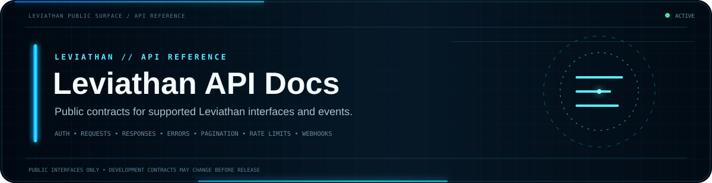
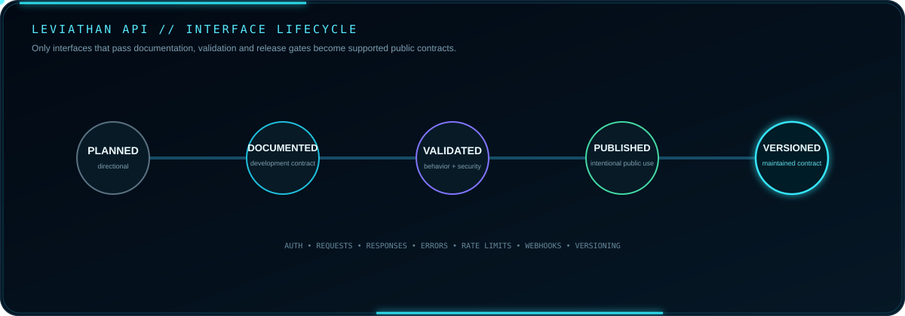

 

**Public interface contracts for supported Leviathan platform integrations.**

[Guide](GUIDE.md) · [SDK](https://github.com/Lapinite/Leviathan-SDK) · [Examples](https://github.com/Lapinite/Leviathan-Examples) · [Integrations](https://github.com/Lapinite/Leviathan-Integrations) · [Security](SECURITY.md)

## Interface lifecycle

  

Only interfaces intentionally released for public use should be represented as available. Planned and development-stage contracts may change before validation and publication.

## API documentation model

<table width="100%">
<tr>
<td width="33%" valign="top"><strong>Request Contract</strong> Authentication · endpoints · parameters · pagination · versioning</td>
<td width="33%" valign="top"><strong>Response Contract</strong> Models · status codes · errors · rate limits · compatibility</td>
<td width="33%" valign="top"><strong>Event Contract</strong> Webhooks · event payloads · verification · lifecycle behavior</td>
</tr>
</table>

## Scope

This repository is intended to document interfaces that are intentionally supported for public use, including:

- authentication requirements for public integrations
- endpoint behavior
- request and response formats
- error handling
- pagination
- rate-limit behavior
- webhooks and event payloads
- versioning and compatibility
- SDK usage
- integration examples

## Suggested reading order

1. [Authentication model](GUIDE.md#authentication-model)
2. [Endpoint conventions](GUIDE.md#endpoint-conventions)
3. [Versioning](GUIDE.md#versioning)
4. [Rate limiting](GUIDE.md#rate-limiting)
5. [Errors](GUIDE.md#errors)
6. [Webhooks](GUIDE.md#webhooks)
7. [SDK usage](GUIDE.md#sdk-usage)
8. [Integrations](GUIDE.md#integrations)
9. [Security](GUIDE.md#security)

## Identity and third-party services

Public API documentation may reference high-level Microsoft, Xbox Live, XSTS, Minecraft Services, Mojang/Minecraft platform and Discord boundaries where they materially affect supported behavior. These are external services, not Leviathan-owned infrastructure.

Leviathan should document its own account mapping, session/permission model, product state and supported public integration behavior without publishing raw credentials, private topology, internal administrative interfaces or proprietary implementation details.

## Security rules for documentation

Examples must use placeholder identifiers and placeholder credentials. Never publish real access tokens, refresh tokens, client secrets, private keys, webhook credentials, bot tokens, database credentials, private endpoints, recovery material, personal information, or administrative identifiers.

Public client identifiers may not be confidential credentials, but identifiers that developers do not need should still be omitted.

## Related repositories

| Repository | Role |
| --- | --- |
| [Leviathan Docs](https://github.com/Lapinite/Leviathan-Docs) | Ecosystem documentation |
| [Leviathan SDK](https://github.com/Lapinite/Leviathan-SDK) | Developer interfaces and helpers |
| [Leviathan Examples](https://github.com/Lapinite/Leviathan-Examples) | Safe implementation patterns |
| [Leviathan Integrations](https://github.com/Lapinite/Leviathan-Integrations) | Public integration patterns |
| [Leviathan Launcher](https://github.com/Lapinite/Leviathan-Launcher) | Public launcher project information |

## Development status

The Leviathan platform is under active development. API documentation will evolve as interfaces stabilize, validation completes, and public contracts are intentionally introduced.

## Minecraft and Microsoft notice

Leviathan is an independent third-party project and is not affiliated with or endorsed by Microsoft, Mojang Studios, Xbox, or Minecraft.
